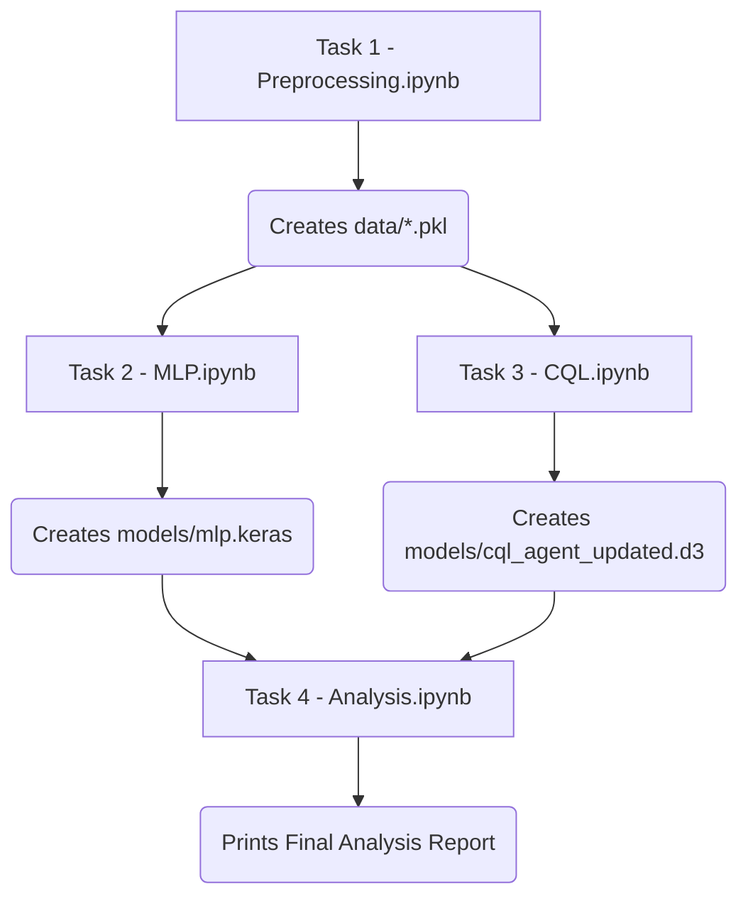

# 🧠 Policy Optimization for Financial Decision-Making

This project presents an in-depth analysis of the **LendingClub Loan Dataset**, focusing on optimizing financial decision-making through two distinct modeling paradigms:

1. **Supervised Deep Learning Model (MLP):** Predicts the *probability* of borrower default using pre-loan attributes.
2. **Offline Reinforcement Learning Agent (CQL):** Learns a *decision policy* aimed at maximizing long-term financial returns.

The project bridges predictive modeling and policy learning to demonstrate how reinforcement learning can enhance decision-making in risk-sensitive financial environments.

---

## 🎯 Objectives

* Implement a **rigorous time-based data split** to eliminate future data leakage.
* Compare **predictive metrics (AUC, F1-Score)** against **decision-making metrics (Estimated Policy Value)**.
* Evaluate how each model’s underlying philosophy (prediction vs. optimization) affects real-world business outcomes.
* Provide a structured workflow for **offline RL-based policy learning** using historical loan data.

---

## 🗂️ Project Structure

The project is organized into four key Jupyter notebooks, each representing a distinct phase of the workflow.
**They should be executed sequentially for reproducible results.**

| Task  | Notebook                     | Description                                                                                                                                     | Output                        |
| ----- | ---------------------------- | ----------------------------------------------------------------------------------------------------------------------------------------------- | ----------------------------- |
| **1** | `task_1_preprocessing.ipynb` | Data loading, cleaning, and feature engineering using only pre-loan attributes. Performs time-based split to prevent data leakage.              | `data/*.pkl`                  |
| **2** | `task_2_mlp.ipynb`           | Builds, trains, and evaluates a TensorFlow/Keras MLP classifier to predict default probability.                                                 | `models/mlp.keras`            |
| **3** | `task_3_cql.ipynb`           | Reframes the task for Offline Reinforcement Learning using `d3rlpy`. Engineers reward signals and trains a Conservative Q-Learning (CQL) agent. | `models/cql_agent_updated.d3` |
| **4** | `task_4_analysis.ipynb`      | Loads both models, performs comparative analysis, and visualizes AUC/F1 vs. Estimated Policy Value.                                             | Final analysis report         |

---

## 🔁 End-to-End Workflow

## 🔁 Project Workflow

---

## 📊 Evaluation Metrics

| Model                   | Metric                           | Description                                                                        |
| ----------------------- | -------------------------------- | ---------------------------------------------------------------------------------- |
| **Deep Learning (MLP)** | **AUC (Area Under ROC Curve)**   | Measures ranking ability and discrimination between defaulters and non-defaulters. |
|                         | **F1-Score**                     | Balances precision and recall for imbalanced datasets.                             |
| **RL Agent (CQL)**      | **Estimated Policy Value (EPV)** | Reflects expected long-term financial returns under the learned policy.            |

The Deep Learning model focuses on accurate *risk prediction*, whereas the RL agent optimizes *decision value* by balancing risk and profitability.

---

## 💡 Key Insights

* The **MLP model** excels at minimizing risk but is conservative in approving borderline applicants.
* The **CQL agent**, trained via offline reinforcement learning, occasionally approves moderate-risk applicants who yield higher expected returns.
* This difference highlights the philosophical contrast between **predictive accuracy** and **decision optimization**.

---

## 🚀 Future Work

1. **Model Validation:**
   Conduct limited live A/B testing before full-scale deployment to validate offline estimates.

2. **Data Enhancement:**
   Incorporate borrower behavioral trends, macroeconomic indicators, and alternative credit signals to improve generalization.

3. **Algorithmic Exploration:**
   Experiment with actor-critic and batch-constrained algorithms (BCQ, TD3+BC) for stability and efficiency.

4. **Hybrid Approaches:**
   Combine supervised learning (for risk prediction) and reinforcement learning (for policy optimization) into a unified decision engine.

---

## 🧹 Tech Stack

* **Languages:** Python 3.12
* **Libraries:** TensorFlow/Keras, d3rlpy, NumPy, Pandas, Scikit-learn
* **Visualization:** Matplotlib, Seaborn, Plotly
* **Tools:** Jupyter Notebook, MLflow (optional for tracking)

---

## 👤 Author

Developed by **Tanveer Singh**

